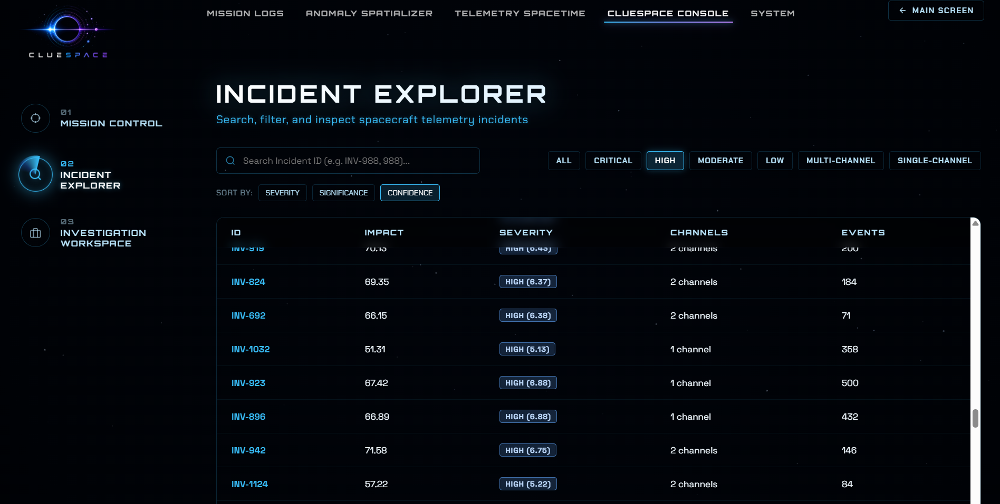
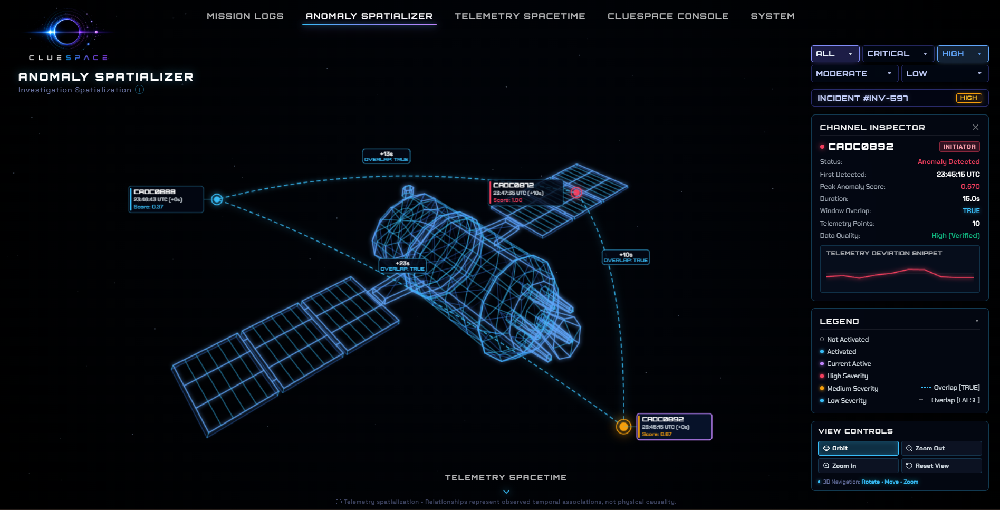
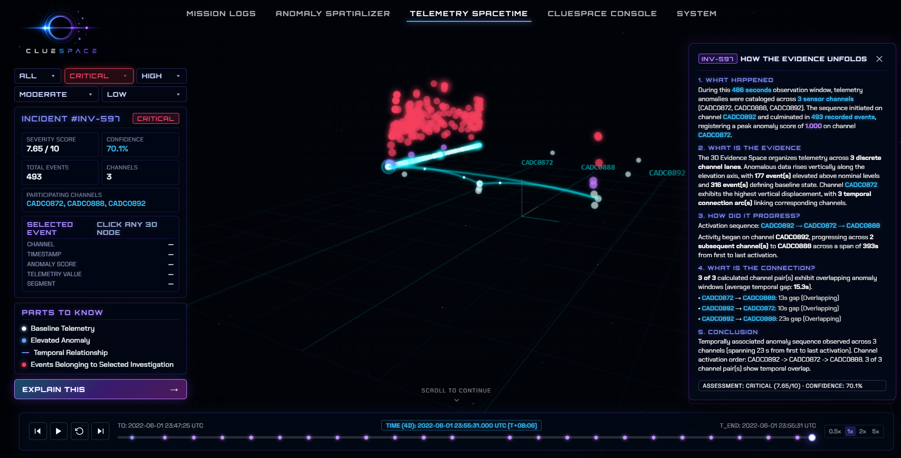

<p align="center">
  
</p>

<h1 align="center">
  <em>ClueSpace</em>
</h1>

<p align="center">
  <strong>Autonomous Telemetry Forensics & Root-Cause Reconstruction Engine</strong>
  <br>
  <em>Where telemetry becomes evidence, and anomalies become answers.</em>
</p>

<p align="center">
  <strong>Challenge:</strong> IBM Bob AI Builders Challenge &middot; <strong>Theme:</strong> Space Telemetry & Autonomous AI Systems
</p>

<p align="center">
  <a href="https://clue-space.vercel.app/"><strong>🌐 Live Application</strong></a> &nbsp;|&nbsp;
  <a href="YOUR_DEMO_VIDEO_LINK"><strong>📹 Demo Video</strong></a>
</p>

---

## The Challenge
> **An anomaly is a signal. An incident is a story.**

Spacecraft continuously generate telemetry across hundreds of telemetry channels. Detecting an anomaly tells engineers that something unusual occurred—but not necessarily how the surrounding incident unfolded.

The evidence needed to investigate an incident is distributed across channels, timestamps, event sequences, anomaly windows, and temporal relationships. Events may occur seconds apart, overlap in time, or form patterns that are difficult to recognize when examined individually.

This creates an **investigation gap**: engineers can identify abnormal signals, but still need to determine **what happened, in what sequence, which events belong together, and what evidence supports the reconstruction.**

> **The real challenge isn't finding the anomaly. It's reconstructing the incident from the evidence.**

That is the problem ClueSpace is built to solve.

---

## The ClueSpace Approach

ClueSpace moves the investigation process from isolated anomaly detection toward **evidence-based incident reconstruction**.

Instead of asking only **"What was anomalous?"**, ClueSpace helps answer:

* **What happened?**
* **When did it happen?**
* **Which events are connected?**
* **How did affected channels behave relative to one another?**
* **What evidence supports the reconstruction?**
* **What should an investigator examine next?**

---

## Product Walkthrough

<table>
  <tr>
    <td width="50%" align="center">
      
      <br><strong>01. Mission Control Fleet Intelligence</strong>
    </td>
    <td width="50%" align="center">
      
      <br><strong>02. Incident Explorer & Case Database</strong>
    </td>
  </tr>
  <tr>
    <td width="50%" align="center">
      
      <br><strong>03. 3D Anomaly Spatializer</strong>
    </td>
    <td width="50%" align="center">
      
      <br><strong>04. 4D Telemetry Spacetime Engine</strong>
    </td>
  </tr>
</table>

### Core Features

* **3D Anomaly Spatializer:** Maps isolated telemetry channels directly onto physical spacecraft components (transponders, solar arrays, battery modules) to visualize subsystem stress and deviation metrics in real time.
* **4D Telemetry Spacetime Visualizer:** Plots multi-sensor anomaly trajectories across 3D coordinate space and time simultaneously. The playback timeline lets operators observe cascade vectors across subsystems.
* **Mission Control Analytics:** Delivers high-level fleet health monitoring across **805 incidents** and **163,199 telemetry events**, distinguishing multi-channel cascades (60.1%) from isolated single-channel failures.
* **Forensic Investigation Workspace:** Automatically builds forensic case files featuring millisecond activation sequences, pairwise lead-lag matrices, 99% signal morphology pattern matching, and automated diagnostic action plans.

---

## Investigation Workflow & Architecture

### From Anomaly to Explanation

Anomaly detection is the **starting point—not the endpoint.**

```text
ANOMALY
"What changed?"
        ↓
TEMPORAL EVIDENCE
"When did related events occur?"
        ↓
CROSS-CHANNEL CORRELATION
"Which signals behaved together?"
        ↓
PATTERN EVIDENCE
"Do their behaviors match?"
        ↓
INCIDENT RECONSTRUCTION
"Which events belong to the same story?"
        ↓
INVESTIGATION INSIGHT
"What should be examined next?"
