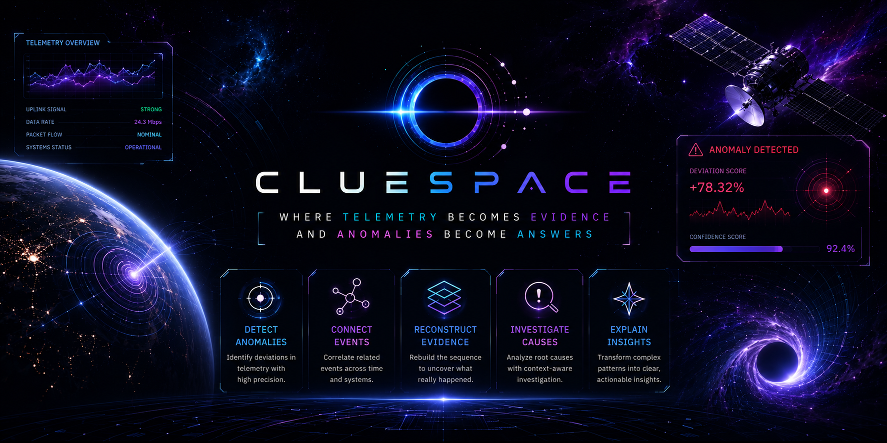

  

# ClueSpace — IBM Bob August Challenge

ClueSpace is a spacecraft incident investigation system that turns fragmented telemetry anomalies into a connected incident story. It links related events across channels and time, reconstructs how an incident unfolded, visualizes the evidence through an interactive Evidence Graph and 3D spacecraft view, and generates a structured investigation with a leading hypothesis, confidence, supporting evidence, and recommended next actions.

**Challenge theme:** Space Mission safety and reliability solutions  
**Challenge:** IBM Bob AI Builders Challenge (August)

**Try it here:** https://clue-space.vercel.app/

**Demo video:** 
 

## At a Glance

| Attribute | Specification |
| :--- | :--- |
| **What** | Spacecraft telemetry incident investigation and reconstruction platform. |
| **Core Problem** | Fragmented anomalies across telemetry channels and time make manual incident reconstruction slow and difficult. |
| **Core Insight** | An anomaly is a signal. An incident is a story. Related telemetry events can be connected across time and channels to reconstruct that story. |
| **Investigation Pipeline** | **Detect → Connect → Reconstruct → Investigate → Explain** |
| **Spatial Intelligence** | 3D spacecraft view for spatial anomaly context + 4D telemetry visualization for exploring how anomalies unfold across space and time. |
| **Evidence Engine** | Temporal lead-lag analysis + signal-pattern similarity + Evidence Graph relationships. |
| **Investigation Output** | Structured incident dossiers with severity, confidence, supporting evidence, leading hypothesis, and recommended investigative actions. |
| **Data Foundation** | 163,199 telemetry events across 805 reconstructed incident profiles using ESA OPS-SAT mission data. |
| **Primary Development Tool** | **IBM Bob** — architecture, backend implementation, testing, debugging, and refinement. |

## The Problem

Modern spacecraft continuously stream high-density telemetry across dozens of isolated subsystem channels (thermal, power, RF, and bus logic). When compound orbital incidents occur:

* **High-Dimensional Telemetry Floods:** Critical warning signals are buried under massive streams of sensor noise, overwhelming ground operators during tight orbital contact passes.
* **Manual Forensics Delays:** Flight controllers must manually correlate flat 2D time-series charts across dozens of channels—a process taking hours or days when every second determines mission survival.
* **Cascading Multi-Channel Blindspots:** Related anomalies can appear across different channels and time windows, making the sequence of an incident difficult to reconstruct manually..

> **The real challenge isn't finding the anomaly. It's reconstructing the incident from fragmented evidence.**

## The Solution

**ClueSpace** is an autonomous incident investigation engine that transforms raw satellite telemetry into spatialized intelligence and actionable recovery protocols.

* **3D Anomaly Spatializer:** Projects live telemetry deviations onto an interactive 3D spacecraft mesh, allowing operators to visually isolate subsystem stress and channel-level deviations instantly.
* **4D Spacetime Trajectory Engine:** Maps multi-channel failure vectors along an interactive spacetime continuum, enabling engineers to scrub across milliseconds and observe failure propagation paths.
* **Autonomous Evidence Graphing:** Reconstructs pairwise activation sequences, calculates lead-lag precedence, and evaluates **99% signal pattern similarities** to confirm causal dependencies.
* **Automated Diagnostic Playbooks:** Synthesizes complex telemetry data into ranked operational directives (e.g., transponder bus isolation, load shedding, thermal loop resets).

## AI Approach & Architecture

ClueSpace follows a hybrid intelligence approach: structured telemetry analysis and evidence-based reasoning form the foundation, while AI helps turn the reconstructed evidence into an understandable investigation.

**Telemetry → Evidence → Investigation → Hypothesis → Action**

### 1. Ingest & Validate

ClueSpace ingests spacecraft telemetry and anomaly events, validates the incoming data, and extracts the information needed for investigation — including timestamps, channels, anomaly scores, severity, and significance.

### 2. Connect the Signals

Instead of examining anomalies in isolation, ClueSpace looks at how events relate across **channels and time**.

It evaluates:

- Lead–lag relationships
- Time-window overlap
- Event sequence consistency
- Signal-pattern similarity
- Deviation and significance

This turns scattered telemetry events into connected investigative evidence.

### 3. Build the Evidence

Related events are organized into an **Evidence Graph**, where nodes represent relevant events or channels and relationships capture the evidence connecting them.

The result is a traceable view of **what happened, when it happened, and which events were related**.

### 4. Score the Investigation

The reconstructed evidence is evaluated using factors such as severity, significance, relationship strength, and sequence consistency.
These signals contribute to an **investigation confidence score**, helping prioritize the strongest investigative paths.

### 5. Explain & Recommend

Once the evidence has been reconstructed, ClueSpace uses AI-assisted reasoning to turn it into a clear investigation:
- **Leading hypothesis**
- **Supporting evidence**
- **Incident explanation**
- **Prioritized investigative actions**

The AI works from the structured evidence produced by the investigation engine rather than replacing the underlying telemetry analysis.

> **ClueSpace doesn't just detect that something went wrong. It connects the clues to help explain what happened — and what to investigate next.**

## System Walkthrough & Visual Proof

ClueSpace is designed as an investigation workflow—not just a collection of dashboards. The following views show how an operator moves from anomaly location and temporal context to fleet-level triage and evidence-backed incident investigation.

| 🛰️ **3D Anomaly Spatializer** | ⏱️ **4D Telemetry Spacetime** |
| :---: | :---: |
|  |  |
| *Pins anomalies to physical satellite components with real-time severity filters.* | *Visualizes multi-channel failure propagation vectors along a 4D spacetime continuum.* |
| 📊 **Mission Control Intelligence** | 🔬 **Forensic Investigation Workspace** |
|  |  |
| *Fleet-wide operational triage across 805 incidents and 163k+ telemetry data points.* | *Dossier with activation sequences, 99% pattern match links, and recovery playbooks.* |

## The 5-Stage Forensics Pipeline

1. **Detect (`01`):** Ingests raw telemetry points (OPS-SAT real spacecraft data) and flags abnormal behavioral drift across channels.
2. **Connect (`02`):** Computes pairwise lead-lag dependencies to uncover hidden temporal links between isolated telemetry channels.
3. **Reconstruct (`03`):** Projects sensor anomalies directly onto interactive 3D satellite coordinates and 4D spacetime point clouds.
4. **Investigate (`04`):** Measures sequence consistency, time gaps ($t_{\text{gap}} < 2\text{s}$), and 99% signal pattern similarity across active nodes.
5. **Explain (`05`):** Synthesizes forensic findings into clear root-cause conclusions with prioritized, actionable diagnostic procedures.

## What an Investigation Produces

For each reconstructed incident, ClueSpace brings the investigation into one place:

- Incident timeline
- Affected telemetry channels
- Temporal relationships
- Evidence Graph
- Signal-pattern relationships
- Severity and significance
- Investigation confidence
- Leading hypothesis
- Recommended investigative actions

The goal is not to replace the engineer's judgment.
It is to reduce the work required to assemble the evidence behind that judgment.

## How IBM Bob Was Used

**IBM Bob** served as our primary AI systems architect and pair programmer throughout development:

* **Plan Mode Architecture:** Used IBM Bob's Plan Mode to break down the incident reconstruction pipeline into discrete modules: event validation, temporal lead-lag analysis, and evidence graph scoring.
* **Core Forensics Engine Implementation:** Leveraged Bob to build and refine the algorithms responsible for calculating pairwise channel overlap, sequence consistency scores, and signal morphology correlations.
* **WebGL & 3D Optimization:** Utilized Bob to implement 3D coordinate bindings from sensor IDs to satellite meshes and optimize rendering performance for 4D spacetime point clouds.
* **Testing & Robustness:** Iterated with Bob to construct unit test suites for schema validation, temporal graph construction, and edge-case multi-channel cascades.

## Why It Matters

Spacecraft operations are data-rich, but incident investigation can still become evidence-poor when related signals are scattered across telemetry channels and time.
ClueSpace helps close that gap by turning fragmented telemetry into a structured investigation that an engineer can inspect, question, and act on.
Instead of spending the investigation manually connecting scattered signals, operators can start from a reconstructed incident and work backward through the evidence.

